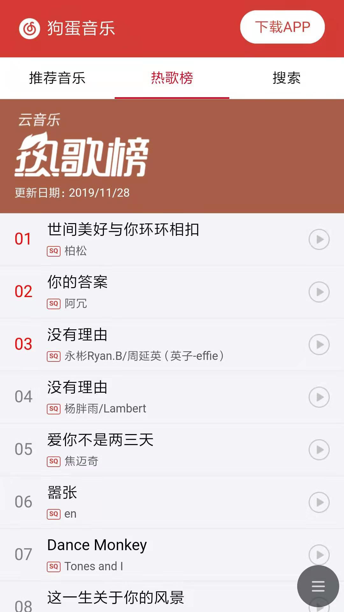

# react-goudan-music

##### 狗蛋音乐 —— 使用 React 实现的仿网易云音乐播放器

##### 在线演示：[Demo地址](http://jaysonl.top/goudan/)

> 项目纯属娱乐，用来熟悉一下React开发相关技术栈
>

|  |    |     |
| ------------------------------- | ---- | ---- |
|   |    |    |


**项目概况**：

- 基础技术栈： `react` + `antd-mobile` + `react-router` + `redux` + `redux-saga`
- 基于 `create-react-app` 创建，使用 `dva` 管理
- 半成品，能用，但目前只有基本的搜索/播放/歌单/排行榜功能
- 自己摸索着一点点写的， 没有参考任何教程，代码/结构可能不太规范

**Todo：**

- 歌词显示
- 无限下拉列表
- 图片懒加载
- `antd-mobile` 换成 `antd` 或者其他UI


## 🔨 Usage

### 服务器部署

获取项目：

```bash
git clone https://github.com/midmis/react-goudan-music.git
git clone https://github.com/Binaryify/NeteaseCloudMusicApi.git
```

使用docker compose部署：

```bash
git clone https://github.com/midmis/react-goudan-music.git
cd react-goudan-music

# 启动容器，监听80端口
docker-compose up -d

# 监听指定端口
EXPORT_PORT=8080 docker-compose up -d

# 停止
docker-compose stop
```


### 本地测试

#### 前端服务

```bash
git clone https://github.com/midmis/react-goudan-music.git
cd react-goudan-music
npm install
npm start
```

#### 后端服务

后端项目为 [@Binaryify](https://github.com/Binaryify/NeteaseCloudMusicApi) 提供的 [网易云音乐 API](https://github.com/Binaryify/NeteaseCloudMusicApi)，感谢。

```bash
git clone https://github.com/Binaryify/NeteaseCloudMusicApi.git
cd reNeteaseCloudMusicApi
npm install
node app.js
```

#### 浏览器访问

浏览器访问：http://localhost:4000
