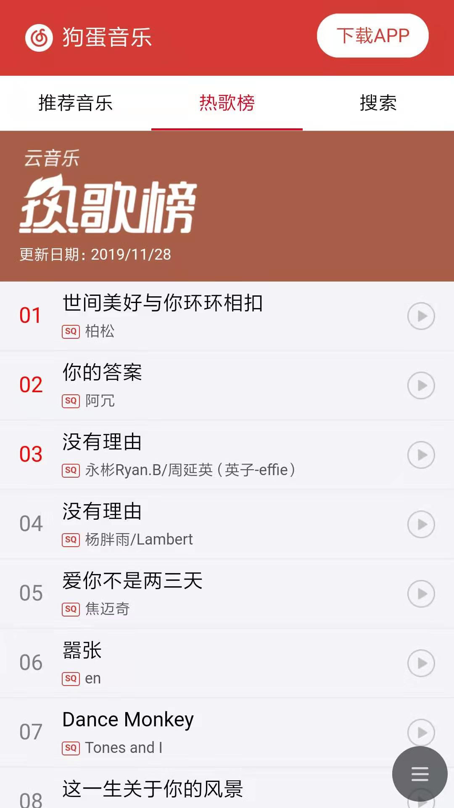
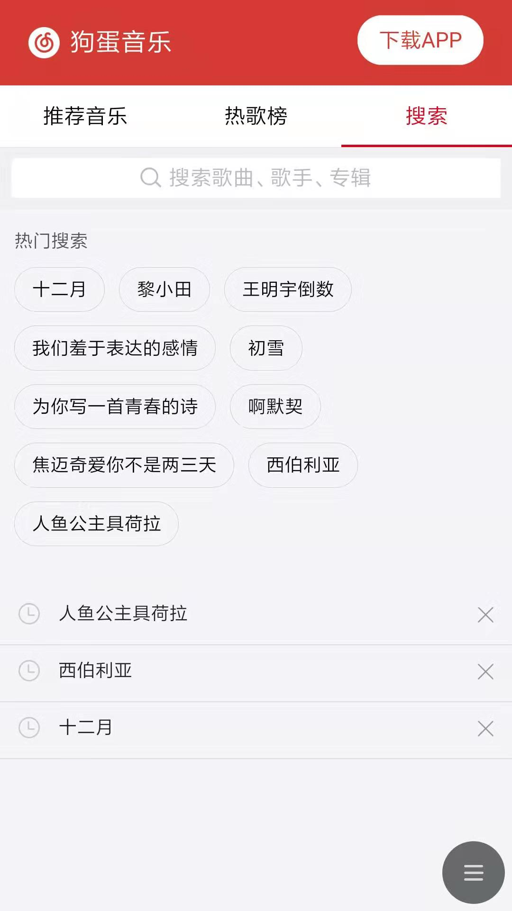
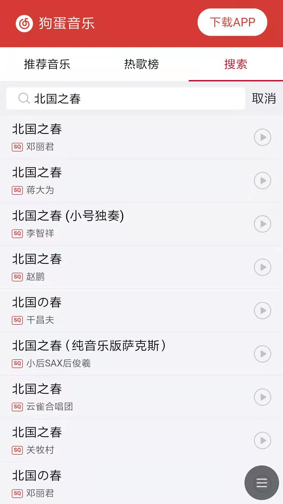

# react-goudan-music

##### 狗蛋音乐 —— 使用 React 实现的仿网易云音乐播放器，在线演示地址：尚无

> 项目纯属娱乐，用来熟悉一下React开发相关技术栈
>

|  |    |     |
| ------------------------------- | ---- | ---- |
|   |    |    |


**项目概况**：

- 基础技术栈： `react` + `antd-mobile` + `react-router` + `redux` + `redux-saga`

- 基于 `create-react-app` 创建，使用 `dva` 管理
- 半成品，能用，但目前只有基本的搜索/播放/歌单/排行榜功能
- 自己摸索着一点点写的， 没有参考任何教程，代码/结构可能不太规范

**Todo：**

- 歌词显示
- 无限下拉列表
- 超长列表渲染优化
- 图片懒加载
- `antd-mobile` 换成 `antd` 或者其他UI


## 🔨 Usage

#### 前端部分

```bash
git clone git@github.com:midmis/react-goudan-music.git
npm install
npm start
```


#### 后端部分

后端项目为 [@Binaryify](https://github.com/Binaryify/NeteaseCloudMusicApi) 提供的 [网易云音乐 API](https://github.com/Binaryify/NeteaseCloudMusicApi)，感谢。

```bash
git clone git@github.com:Binaryify/NeteaseCloudMusicApi.git
npm install

# Mac/Linux
PORT=4000 node app.js

# Windows, use git-bash or cmder
set PORT=4000 && node app.js

```


